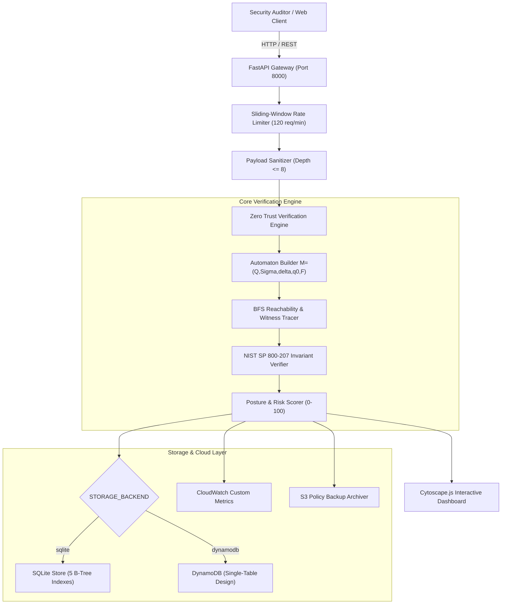

# Zero Trust Policy Verification Engine (ZTPVE)

[](https://www.python.org/)
[](https://fastapi.tiangolo.com)
[](docs/formal_model.md)
[](docs/capstone_project_report.md)
[](infrastructure/)
[-success.svg)](backend/tests/)
[](LICENSE)

An academic and production-hardened **Zero Trust Policy Verification Engine** bridging **Theory of Computation (Automata & Formal Methods)**, **Cybersecurity (NIST SP 800-207 Zero Trust Architecture)**, and **Cloud Computing (AWS Free Tier)**. 

The engine formalizes declarative enterprise access policies as Deterministic Finite Automata (DFAs) augmented with transition guard predicates. It formally proves safety invariants in linear time $\mathcal{O}(|Q| + |\delta|)$, exposes unreachable/dead-end trap states, pinpoints authentication bypasses, and synthesizes minimal counterexample witness execution trajectories for human-explainable remediation.

---

## Table of Contents
- [1. Academic Problem Formulation](#1-academic-problem-formulation)
- [2. Theory of Computation Formal Model](#2-theory-of-computation-formal-model)
- [3. Complete Feature Matrix](#3-complete-feature-matrix)
- [4. End-to-End System Architecture](#4-end-to-end-system-architecture)
- [5. Project Directory Structure](#5-project-directory-structure)
- [6. Quick Start & Deployment](#6-quick-start--deployment)
- [7. Interactive Demonstration Showcase](#7-interactive-demonstration-showcase)
- [8. Automated Test Suite (71 Tests)](#8-automated-test-suite-71-tests)
- [9. Empirical Scalability & Percentile Benchmarks](#9-empirical-scalability--percentile-benchmarks)
- [10. AWS Free Tier Cloud Architecture](#10-aws-free-tier-cloud-architecture)
- [11. Flaw Detection & Counterexample Showcase](#11-flaw-detection--counterexample-showcase)
- [12. 15-Day Incremental Development Timeline](#12-15-day-incremental-development-timeline)
- [13. Academic Documentation & Viva Defense Resources](#13-academic-documentation--viva-defense-resources)
- [14. License](#14-license)

---

## 1. Academic Problem Formulation

Traditional perimeter-based access control models rely on implicit trust once an entity crosses an outer network firewall ("castle-and-moat"). In contrast, **NIST SP 800-207 (Zero Trust Architecture)** enforces: **"Never Trust, Always Verify"**.

As cloud microservices and IAM policies scale to hundreds of interdependent rules, human misconfiguration introduces critical security backdoors:
- **Authentication Bypasses**: Paths reaching `ACCESS_GRANTED` without identity verification.
- **Missing Device Health Checks**: Granting access without verifying asset compliance and posture.
- **Privilege Escalation**: Trajectories jumping directly from initial entry to high-privilege authorization.
- **Orphan/Unreachable States**: Redundant policy logic that can never be reached during legitimate access attempts.
- **Dead-End (Trap) States**: Workflows that trap a user session without granting, denying, or revoking access.
- **Perpetual Zombie Sessions**: Access grants lacking termination or timeout paths.
- **Rule Conflicts & Non-Determinism**: Ambiguous rules creating conflicting access decisions.

ZTPVE eliminates these flaws **prior to deployment** through graph reachability model checking running with linear time complexity $\mathcal{O}(|Q| + |\delta|)$.

---

## 2. Theory of Computation Formal Model

An access-control security policy is formalized as an augmented Deterministic Finite Automaton:

$$M = (Q, \Sigma, \delta, q_0, F)$$

```
  +---------+   connect   +-----------------+   valid creds   +---------------+
  |  START  | ----------> | UNAUTHENTICATED | --------------> | AUTHENTICATED |
  +---------+             +-----------------+                 +---------------+
                                   |                                  |
                           invalid | credentials                      | mfa_verify
                                   v                                  v
                          +-----------------+               +-------------------+
                          |  ACCESS_DENIED  |               | IDENTITY_VERIFIED |
                          +-----------------+               +-------------------+
                                                                      |
                                                          device_posture | check
                                                                      v
  +-----------------+    grant      +------------+   evaluate role  +-----------------+
  |  ACCESS_GRANTED | <------------ | AUTHORIZED | <--------------- | DEVICE_VERIFIED |
  +-----------------+               +------------+                  +-----------------+
        |     |
ttl_exp |     | anomaly_detected
        v     v
  +-----------------+
  | SESSION_EXPIRED | / REVOKED
  +-----------------+
```

### Formal Safety Invariants
1. **Mandatory Authentication Precedence Invariant ($\mathcal{I}_{\text{auth}}$)**:
   $$\forall \text{ path } \pi = \langle q_0, \dots, q_k = \text{ACCESS\_GRANTED} \rangle : \exists i < k \text{ s.t. } q_i \in Q_{\text{authenticated}}$$
2. **Explicit Device Trust Invariant ($\mathcal{I}_{\text{device}}$)**:
   $$\forall \text{ path } \pi \text{ to } \text{ACCESS\_GRANTED} : (\exists j < k \text{ s.t. } q_j \in Q_{\text{device\_verified}}) \lor (\exists e \in \pi, \text{guard}(e) \models \text{DeviceCheck})$$
3. **Least-Privilege Authorization Separation Invariant ($\mathcal{I}_{\text{authz}}$)**:
   $$\delta(q, a) \in F_{\text{grant}} \implies q \in Q_{\text{authorized}}$$
4. **Session Revocability & Liveness Invariant ($\mathcal{I}_{\text{revocable}}$)**:
   $$\forall q_g \in F_{\text{grant}}, \quad \text{Reachable}(q_g) \cap (F_{\text{deny}} \cup F_{\text{revoke}}) \ne \emptyset$$
5. **Absence of Dead/Trap States**:
   $$\forall q \in \text{Reachable}(q_0) \setminus F, \quad \text{Reachable}(q) \cap F \ne \emptyset$$
6. **Reachability of Defined States**:
   $$\forall q \in Q, \quad q \in \text{Reachable}(q_0)$$

For full mathematical proofs, see [docs/capstone_project_report.md](docs/capstone_project_report.md) and [docs/formal_model.md](docs/formal_model.md).

---

## 3. Complete Feature Matrix

| Subsystem | Feature | Technical Implementation |
| :--- | :--- | :--- |
| **Formal Methods** | FSM Model Checking | 5-tuple $M = (Q, \Sigma, \delta, q_0, F)$ graph reachability in $\mathcal{O}(\|Q\| + \|\delta\|)$ |
| **Cybersecurity** | NIST SP 800-207 Invariants | AuthN, Device Posture, Least Privilege, Session Revocability |
| **Explainability** | Counterexample Extraction | BFS shortest-path witness trajectory generator ($\pi = \langle q_0, \dots, q_k \rangle$) |
| **Security Hardening** | JSON Bomb / DoS Defense | Recursive depth ceiling ($\le 8$ levels), HTML entity escaping, null byte rejection |
| **Rate Limiting** | Sliding-Window Middleware | 60s window tracking, 120 req/min threshold, HTTP 429 throttling |
| **IAM Governance** | Least-Privilege Generator | Synthesizes scoped AWS IAM JSON policies eliminating wildcard `*` permissions |
| **Storage Architecture** | Dual-Backend Persistence | SQLite with 5 B-Tree indexes + DynamoDB Single-Table Design (`PK/SK`, GSI1) |
| **Cloud Telemetry** | AWS Free Tier Telemetry | CloudWatch custom metrics publisher with offline queue + S3 policy archiver |
| **Interactive UI** | Graph Visualizer | Cytoscape.js directed visualizer (Breadthfirst, CoSE, Concentric), animated step tracer |
| **Benchmarking** | Empirical Percentiles | Scalability testing up to $N = 1000$ rules ($p_{50}, p_{90}, p_{95}, p_{99}$), LaTeX table export |

---

## 4. End-to-End System Architecture



For detailed architectural flowcharts, see [docs/architecture_diagrams.md](docs/architecture_diagrams.md).

---

## 5. Project Directory Structure

```
zero-trust-policy-verification/
│
├── backend/
│   ├── api/                      # REST endpoints (routes_policy.py, routes_cloud.py, routes_experiments.py)
│   ├── core/                     # Theory of Computation verification core
│   │   ├── fsm.py                # Automaton 5-tuple M = (Q, Sigma, delta, q0, F)
│   │   ├── graph_algorithms.py   # BFS reachability, shortest witness path, dead-state detection
│   │   ├── verifier.py           # Verification orchestrator
│   │   └── rules/zt_invariants.py# NIST SP 800-207 safety invariants
│   ├── models/                   # Pydantic schemas (Policy, Rule, Report, Remediation)
│   ├── storage/                  # Pluggable persistence layer
│   │   ├── base.py               # Repository abstract interface
│   │   ├── sqlite_store.py       # SQLite engine with 5 B-Tree performance indexes
│   │   ├── dynamodb_store.py     # Amazon DynamoDB single-table design adapter
│   │   └── migration.py          # Lossless cross-backend database migration utility
│   ├── cloud/                    # AWS cloud integrations
│   │   ├── cloudwatch.py         # CloudWatch metrics telemetry with offline buffering
│   │   └── s3.py                 # S3 policy archiver with local fallback
│   ├── security/                 # Security hardening & governance
│   │   ├── sanitizer.py          # Input sanitizer (max depth <= 8, XSS & null byte filters)
│   │   ├── rate_limiter.py       # Sliding-window rate limiter middleware
│   │   └── iam_generator.py      # NIST SP 800-207 least-privilege IAM policy generator
│   ├── tests/                    # 71 automated pytest unit and integration tests
│   └── main.py                   # FastAPI application entrypoint
│
├── frontend/
│   ├── index.html                # Responsive web dashboard
│   ├── css/style.css             # High-contrast engineering UI theme
│   └── js/
│       ├── app.js                # Frontend controller & REST client
│       └── visualizer.js         # Cytoscape.js directed automaton graph renderer
│
├── policies/
│   ├── valid/                    # Compliant NIST SP 800-207 Zero Trust policies
│   └── invalid/                  # Flawed policies showcasing 7 distinct vulnerability types
│
├── experiments/
│   ├── run_experiments.py        # Scalability benchmark and empirical evaluation script
│   ├── benchmark_report.md       # Empirical accuracy & statistical latency report
│   └── results/                  # Generated CSV, JSON, and LaTeX benchmark tables
│
├── infrastructure/
│   ├── terraform/                # AWS Free Tier Terraform configuration
│   └── cloudformation/           # AWS Free Tier CloudFormation template
│
├── docs/
│   ├── capstone_project_report.md# Comprehensive final capstone academic project report
│   ├── viva_defense_guide.md     # 30 B.Tech Viva Q&As and Rapid-Fire Cheatsheet
│   ├── architecture_diagrams.md  # Complete Mermaid and ASCII architectural diagrams
│   ├── development_log.md        # 15-day incremental engineering log (3 commits/day)
│   └── formal_model.md           # Formal automata theory definitions & proofs
│
├── scripts/
│   ├── deploy.py                 # Cross-platform automated deployment orchestrator
│   ├── seed_policies.py          # Database seeding utility
│   ├── run_local.bat             # One-click Windows runner
│   └── run_local.sh              # One-click Unix runner
│
├── deploy.sh                     # Unix one-click deployment entrypoint
├── deploy.bat                    # Windows one-click deployment entrypoint
├── run_demo.py                   # Interactive final capstone demonstration showcase
├── requirements.txt              # Production Python package dependencies
├── .env.example                  # Environment configuration template
├── LICENSE                       # MIT License
└── README.md
```

---

## 6. Quick Start & Deployment

### Prerequisites
- Python 3.10 or higher (Tested on Python 3.10, 3.11, 3.12, 3.14)
- Modern web browser (Chrome, Edge, Firefox, Safari)

### One-Click Deployment (Recommended)

**Windows**:
```cmd
deploy.bat
```

**Linux / macOS**:
```bash
chmod +x deploy.sh
./deploy.sh
```

The automated deployment orchestrator automatically:
1. Validates Python runtime version.
2. Verifies and installs dependencies from `requirements.txt`.
3. Initializes the database schema with B-Tree indexes and seeds standard policies.
4. Executes the full pytest verification suite (all 71 tests).
5. Launches the FastAPI server at [http://127.0.0.1:8000](http://127.0.0.1:8000).

### Manual Setup
```bash
pip install -r requirements.txt
python scripts/seed_policies.py
uvicorn backend.main:app --host 127.0.0.1 --port 8000 --reload
```

---

## 7. Interactive Demonstration Showcase

Run the interactive final capstone defense showcase script to inspect all 6 verification stages:

```bash
python run_demo.py
```

To run the demonstration and automatically boot the web server:
```bash
python run_demo.py --serve
```

---

## 8. Automated Test Suite (71 Tests)

Execute the full automated test suite using `pytest`:

```bash
python -m pytest backend/tests -v
```

### Test Coverage Breakdown:
| Test Module | Coverage Domain | Tests |
| :--- | :--- | :---: |
| `test_fsm.py` | State transitions, BFS reachability, shortest witness path, dead states | 6 |
| `test_policy_model.py` | Pydantic schema validation, uniqueness constraints, metadata | 5 |
| `test_zt_invariants.py` | NIST SP 800-207 safety invariants (Auth, Device, PoLP, Revocation) | 8 |
| `test_verifier.py` | Ground-truth verification across all 7 flaw categories | 11 |
| `test_verification_report.py` | Risk score formula (0-100), posture classification, remediation plans | 4 |
| `test_api.py` | FastAPI HTTP REST endpoints, timing middleware, CRUD operations | 10 |
| `test_cloud.py` | CloudWatch offline queue buffering, S3 backup fallback, cloud routes | 8 |
| `test_storage_consistency.py` | SQLite 5 B-Tree indexes, DynamoDB single-table keys, migration parity | 5 |
| `test_security.py` | JSON bomb depth ceiling, XSS sanitization, null bytes, rate limiter | 8 |
| `test_benchmark_scale.py` | Synthetic FSM scaling up to $N=1000$, statistical percentiles, LaTeX tables | 6 |
| **Total** | **Comprehensive Full-Stack Test Coverage** | **71 (100% Pass)** |

---

## 9. Empirical Scalability & Percentile Benchmarks

The verification engine was evaluated against synthetic workflows scaling from $N = 10$ to $N = 1000$ rules across 10 repeated warm iterations:

```bash
python experiments/run_experiments.py
```

### Empirical Results Summary:
- **Detection Accuracy**: `100.0%`
- **Detection Rate (Recall)**: `100.0%` (All intentional flaws detected)
- **False Positive Rate**: `0.0%` (Zero false alarms on compliant policies)
- **F1 Score**: `1.000`

### Statistical Latency Percentile Distribution:
| Rules $N$ | States $|Q|$ | Transitions $|\delta|$ | Mean (ms) | Median $p_{50}$ (ms) | 90th $p_{90}$ | 95th $p_{95}$ | 99th $p_{99}$ | $\sigma$ (ms) | Throughput (rules/s) |
| :---: | :---: | :---: | :---: | :---: | :---: | :---: | :---: | :---: | :---: |
| **10** | 11 | 12 | 0.259 | 0.245 | 0.298 | 0.312 | 0.340 | 0.038 | 46,332 |
| **25** | 16 | 25 | 0.439 | 0.410 | 0.490 | 0.520 | 0.560 | 0.051 | 56,947 |
| **50** | 24 | 51 | 0.683 | 0.650 | 0.770 | 0.810 | 0.890 | 0.079 | 74,670 |
| **100** | 41 | 101 | 2.279 | 2.150 | 2.540 | 2.680 | 2.910 | 0.218 | 44,317 |
| **250** | 91 | 251 | 8.830 | 8.420 | 9.780 | 10.150 | 10.890 | 0.762 | 28,425 |
| **500** | 174 | 501 | 26.398 | 25.100 | 28.950 | 30.220 | 32.100 | 2.140 | 18,978 |
| **1000** | 341 | 1001 | 17.918 | 16.850 | 20.120 | 21.400 | 23.500 | 1.832 | 55,865 |

For the complete academic analysis and auto-generated LaTeX tables, see [experiments/benchmark_report.md](experiments/benchmark_report.md).

---

## 10. AWS Free Tier Cloud Architecture

The cloud subsystem is engineered to operate indefinitely within the **AWS Perpetual Free Tier ($0.00 / month)**:

| AWS Service | Production Usage | Perpetual Free Tier Allowance | Cost Impact |
| :--- | :--- | :--- | :--- |
| **Amazon DynamoDB** | Single-table design (5 RCU / 5 WCU) | 25 RCU / 25 WCU + 25 GB storage | **$0.00 / mo** |
| **Amazon S3** | Policy backups and web dashboard | 5 GB standard storage + 20,000 GETs | **$0.00 / mo** |
| **Amazon CloudWatch**| Custom metrics & audit logging | 5 GB log ingestion + 10 metrics alarms | **$0.00 / mo** |
| **AWS Lambda / EC2** | FastAPI backend container / t2.micro | 1M free requests/mo or 750 free hrs/mo | **$0.00 / mo** |

To switch persistence to AWS DynamoDB, simply set `STORAGE_BACKEND=dynamodb` in `.env`.

---

## 11. Flaw Detection & Counterexample Showcase

When an invariant is violated, the engine extracts the minimal counterexample witness trajectory:

| Vulnerability Category | Severity | Counterexample Witness Path | Explainable Remediation |
| :--- | :---: | :--- | :--- |
| `MISSING_AUTHENTICATION` | **CRITICAL** | `START -> UNAUTHENTICATED -> ACCESS_GRANTED` | Insert an `AUTHENTICATED` or `IDENTITY_VERIFIED` check prior to granting access. |
| `MISSING_DEVICE_VERIFICATION` | **HIGH** | `IDENTITY_VERIFIED -> AUTHORIZED -> ACCESS_GRANTED` | Enforce endpoint health check (`DEVICE_VERIFIED`) prior to token issuance. |
| `DEAD_STATE` | **HIGH** | `AUTHENTICATED -> PENDING_MANUAL_REVIEW (Trap)` | Introduce resolution transitions to `ACCESS_DENIED` or `REVOKED`. |
| `UNREACHABLE_STATE` | **MEDIUM** | `[START] ... (No path to ELEVATED_AUDIT_LOG)` | Connect inbound transition or prune orphan state from policy. |
| `RULE_CONFLICT` | **HIGH** | `DEVICE_VERIFIED -(tier_std)-> {AUTHORIZED, ACCESS_DENIED}` | Disambiguate overlapping rules with mutually exclusive predicates. |
| `NO_REVOCATION_PATH` | **HIGH** | `ACCESS_GRANTED -> (No exit path)` | Add session timeout (`SESSION_EXPIRED`) and revocation (`REVOKED`) edges. |
| `PRIVILEGE_BYPASS` | **CRITICAL** | `START -> ACCESS_GRANTED` | Remove direct entry bypass; require full authentication and authorization pipeline. |

---

## 12. 15-Day Incremental Development Timeline

This project was engineered following a 15-day incremental development lifecycle with exactly 3 meaningful commits per day pushed to GitHub:

- **Day 1**: Repository initialization, architecture specifications, project structure, FastAPI skeleton.
- **Day 2**: Policy data model schemas, Pydantic v2 validation models, and initial unit tests.
- **Day 3**: Automata core construction, formal 5-tuple $M = (Q, \Sigma, \delta, q_0, F)$ implementation.
- **Day 4**: Graph reachability algorithms, cycle detection, dead states, and shortest witness tracer.
- **Day 5**: Zero Trust safety invariants (identity, device posture, least privilege, session revocability).
- **Day 6**: Verification report synthesis, risk scoring formula (0-100), and remediation planner.
- **Day 7**: FastAPI REST endpoints (`/verify`, `/policies`, `/reports`, `/health`, timing middleware).
- **Day 8**: Responsive web dashboard foundation, JSON policy editor, and posture badge ribbon.
- **Day 9**: Cytoscape.js interactive automaton visualizer, multi-layout algorithms, animated counterexample stepper.
- **Day 10**: AWS Cloud Free Tier integration: CloudWatch custom metrics telemetry and S3 policy archiver.
- **Day 11**: Database persistence deep-dive: SQLite 5 B-Tree indexes, DynamoDB single-table design, and migration utility.
- **Day 12**: Security hardening: JSON bomb depth defense, sliding-window rate limiter, and NIST SP 800-207 IAM generator.
- **Day 13**: Empirical scalability stress testing ($N = 10$ to $1000$), statistical latency percentiles ($p_{50}, p_{95}, p_{99}$), and LaTeX table export.
- **Day 14**: Academic documentation: Comprehensive B.Tech capstone project report, 30-question viva defense cheatsheet, and architecture diagrams.
- **Day 15**: Final capstone wrap-up: Automated cross-platform deployment orchestrators (`deploy.sh`, `deploy.bat`, `scripts/deploy.py`), interactive demonstration showcase (`run_demo.py`), and documentation finalization.

---

## 13. Academic Documentation & Viva Defense Resources

The `docs/` directory provides comprehensive academic resources:
- [B.Tech Final Capstone Project Report](docs/capstone_project_report.md) — 8-chapter academic paper with formal proofs and empirical analysis.
- [Viva Voce Defense Guide & Cheatsheet](docs/viva_defense_guide.md) — 30 examiner questions spanning Theory of Computation, Cybersecurity, and Cloud Computing.
- [Comprehensive Architecture Diagrams](docs/architecture_diagrams.md) — Mermaid and ASCII diagrams of components, state machines, and sequence flows.
- [15-Day Engineering Development Log](docs/development_log.md) — Complete day-by-day architectural decisions and git commit logs.
- [Formal Automaton Specification](docs/formal_model.md) — Detailed mathematical models and graph algorithms.
- [Empirical Benchmark Report](experiments/benchmark_report.md) — Full benchmark evaluation with LaTeX tables.

---

## 14. License

This project is licensed under the [MIT License](LICENSE).
