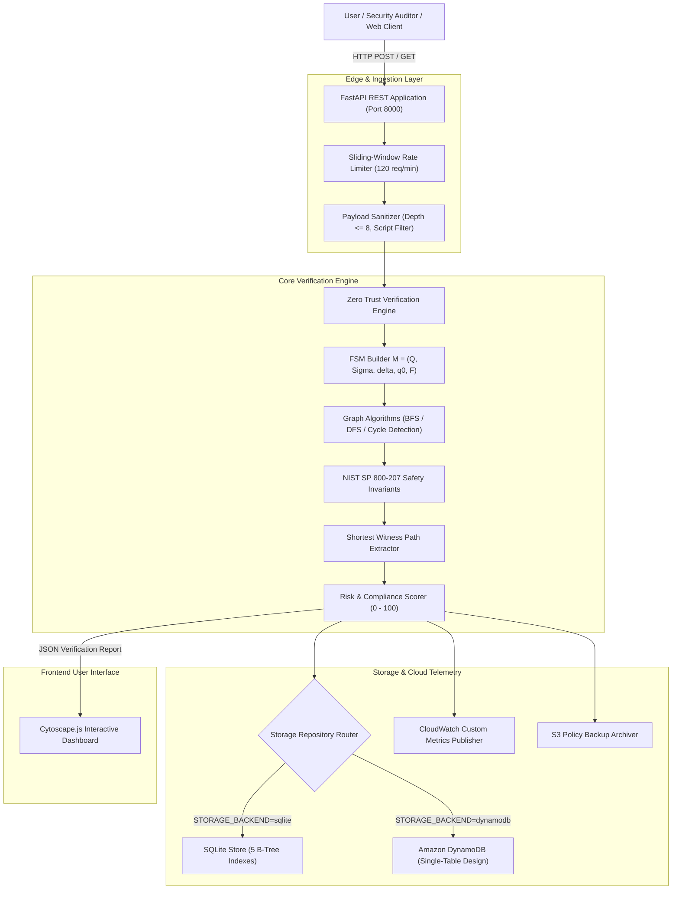
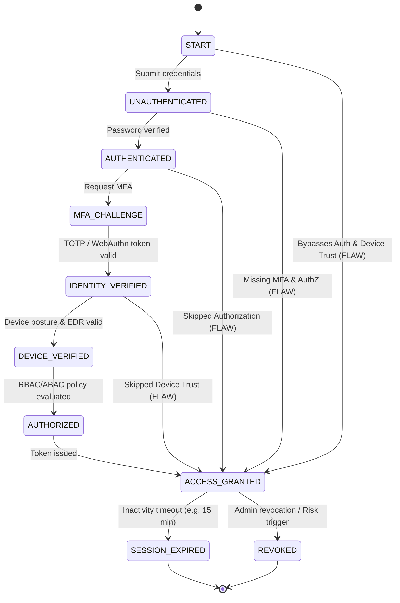
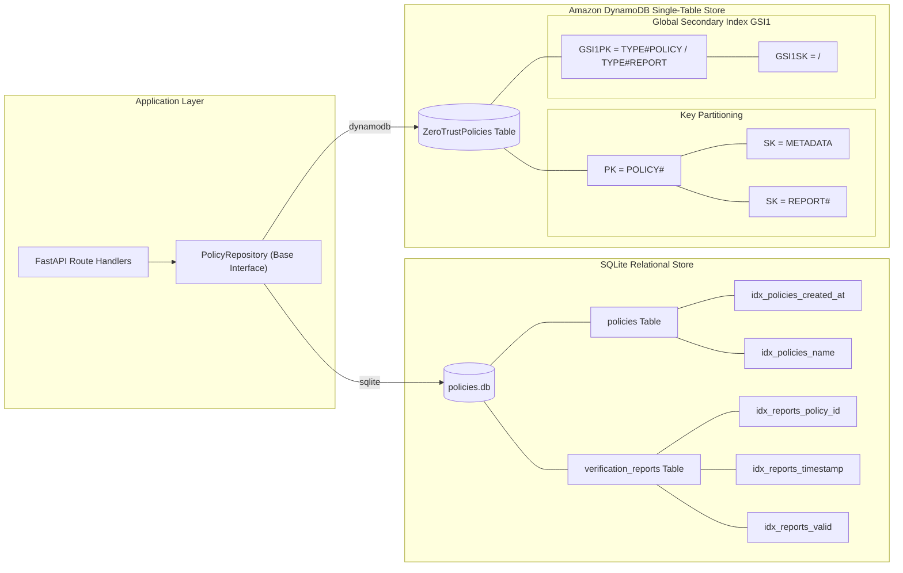
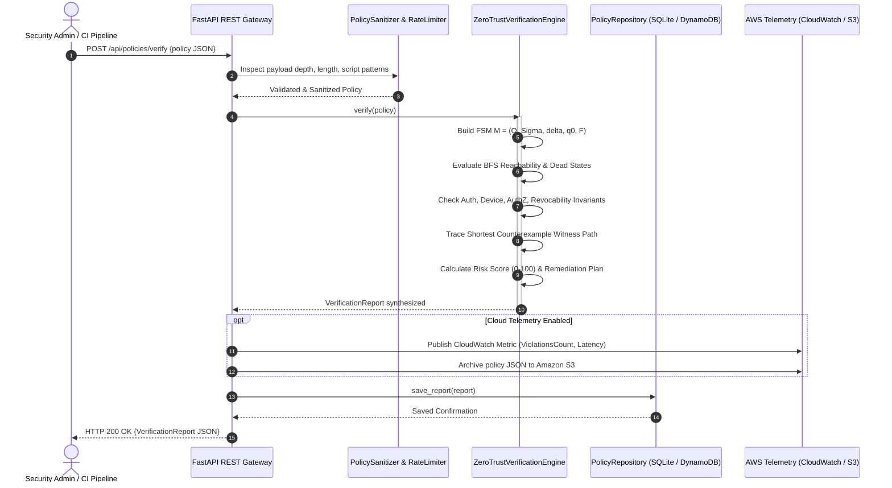

# Zero Trust Policy Verification Engine (ZTPVE)
## Comprehensive System Architecture Diagrams

This document contains architectural diagrams in standard Mermaid and ASCII formats, illustrating system components, automaton state transitions, data persistence models, and invariant verification sequences.

---

## 1. End-to-End System Architecture



---

## 2. Finite State Automaton State-Transition Lifecycle

The diagram below contrasts a fully compliant Zero Trust authentication-authorization trajectory with prohibited backdoor trajectories:



---

## 3. Dual-Backend Persistence Architecture



---

## 4. Verification Sequence Diagram



---

## 5. Security Guard Pipeline & Threat Mitigation

```
[ Incoming HTTP Request ]
           │
           ▼
┌────────────────────────────────────────────────────────┐
│ 1. Sliding-Window Rate Limiter (backend/security/)     │
│    - Checks Client IP in 60s sliding window            │
│    - Allows max 120 requests/minute                    │
│    - Emits X-RateLimit-Limit & X-RateLimit-Remaining   │
│    - Rejects burst flooding with HTTP 429              │
└──────────────────────────┬─────────────────────────────┘
                           │ Passed
                           ▼
┌────────────────────────────────────────────────────────┐
│ 2. Policy Input Sanitizer (backend/security/)          │
│    - Rejects JSON Nesting Depth > 8 (JSON Bombs)       │
│    - Filters <script>, javascript:, onerror= (XSS)     │
│    - Rejects Null Byte (\x00) Poisoning                │
│    - Enforces Rule Limit <= 5000                       │
│    - Rejects malformed payload with HTTP 400           │
└──────────────────────────┬─────────────────────────────┘
                           │ Sanitized
                           ▼
┌────────────────────────────────────────────────────────┐
│ 3. Zero Trust Verification Engine (backend/core/)      │
│    - Evaluates Automaton Invariants in O(|Q| + |delta|)│
│    - Computes Risk Score and Posture Category          │
└────────────────────────────────────────────────────────┘
```
